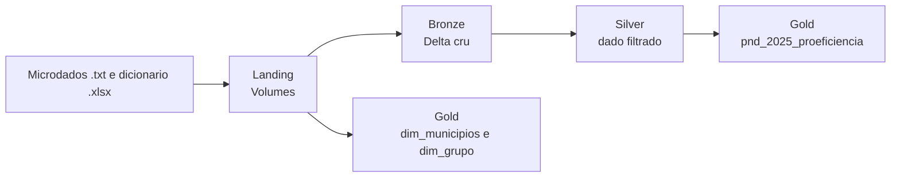

# PND 2025 | Pipeline Medallion no Databricks + Git Hub + Power BI

Pipeline de dados que ingere os microdados da **Prova Nacional Docente (PND) 2025**, do Inep, e entrega uma tabela analítica de proficiência por município, grupo e caderno, com suas dimensões.

**Stack:** Databricks Free Edition (serverless) · Unity Catalog · Delta Lake · PySpark · SQL · Git

## Fonte dos dados

[Inep | Prova Nacional Docente | Resultados](https://www.gov.br/inep/pt-br/areas-de-atuacao/avaliacao-e-exames-educacionais/prova-nacional-docente/resultados) 

Microdados (13 arquivos `.txt`)

dicionário de dados (`.xlsx`).

Os dados **não** estão neste repositório. Baixe-os na fonte oficial.


## Arquitetura



| Camada | Conteúdo | Regra principal |
|---|---|---|
| **Landing** | Volumes `dados_txt`, `dicionarios` e `apoio` | Arquivos originais, sem alteração |
| **Bronze** | Uma tabela Delta por arquivo, mais log de auditoria | Dado cru, tudo como texto |
| **Silver** | `microdados2025_pnd_arq01` | Filtra `tp_pres = 555` e remove `ds_vt_ace_obj` |
| **Gold** | `pnd_2025_proeficiencia`, `dim_municipios`, `dim_grupo` | Agregação e dimensões de consumo |

Catálogo Unity Catalog: `pnd2025`, com os schemas `landing`, `bronze`, `silver` e `gold`.

## Modelo da camada gold

**`pnd_2025_proeficiencia`**: chave `nu_ano` + `co_grupo` + `co_municipio_prova` + `co_caderno`; medidas `media_proficiencia` e `media_qt_acertos`.

| Dimensão | Colunas | Relaciona com a fato por |
|---|---|---|
| `dim_municipios` | `co_municipio`, `nm_municipio`, `uf`, `uf_descritor` | `co_municipio_prova` |
| `dim_grupo` | `co_grupo`, `ds_grupo` | `co_grupo` |

**Limitação conhecida:** os arquivos `arq2` a `arq13` trazem apenas `nu_ano`, `co_grupo` e as respostas do caderno. Não há campo para ligá-los ao `arq01` linha a linha, então a gold usa só o `arq01` e o vínculo entre arquivos é feito apenas por `co_grupo`.

## Estrutura do repositório

```
notebooks/
├── 00_landing/   estrutura do catálogo e volumes
├── 01_bronze/    ingestão dos .txt em Delta, com log de auditoria
├── 02_silver/    filtro e remoção de colunas
└── 03_gold/      tabela de proficiência e dimensões
sql/              consultas
pipeline/         jobs e workflows
docs/             documentação e imagens
```

## CI/CD com Git Hub


## Resultados | Power BI Analytics


## Como reproduzir

1. Crie um workspace no Databricks (a Free Edition basta) e conecte este repositório como **Git folder**.
2. Baixe os microdados e o dicionário no site do Inep.
3. Rode `00_landing` e faça o upload dos arquivos para os volumes criados.
4. Rode os notebooks em ordem: `01_bronze`, `02_silver`, `03_gold`.

Cada notebook é dividido em passos, um por célula, com documentação em Markdown. Todos podem ser reexecutados.


## Autor

Leonardo Andrade · [GitHub](https://github.com/leonardo-reginaldo) 2026 · 

